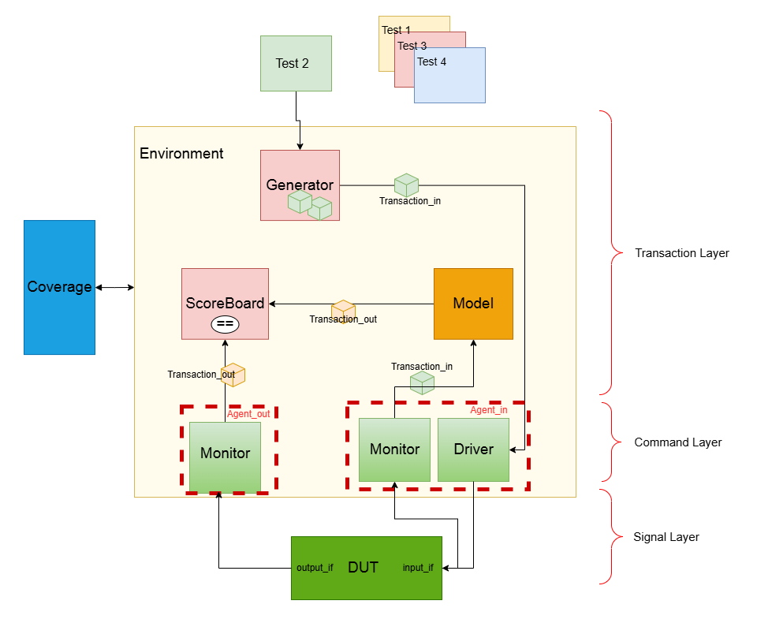

# Multi-Cycle ALU SystemVerilog Verification Environment

This repository contains the source code for a robust, modular verification environment designed to test a multi-cycle Arithmetic Logic Unit (ALU). The testbench is written entirely in **SystemVerilog** and follows a standard layered architecture, promoting reusability and a clean separation of concerns.

## Verification Architecture

The environment is built using a layered approach, separating the test, transaction, and signal layers. This architecture, commonly used in industry methodologies like UVM, allows for powerful and flexible verification.

* **Signal Layer:** The lowest level, containing the DUT and interfaces (`input_if`, `output_if`) that handle the physical pin wiggling.
* **Command Layer:** Consists of the **Driver** and **Monitor**. The Driver converts transactions into signal-level activity, while the Monitor observes signal activity and converts it back into transactions.
* **Transaction Layer:** The highest level of abstraction. It includes the **Generator** (creates input transactions), the **Model** (a behavioral or "golden" reference of the DUT), and the **Scoreboard** (compares outputs from the DUT and the Model to check for correctness).
* **Test Layer:** This is where specific tests are defined (e.g., `random_test`, `test_high`). Tests configure the environment and control the stimulus generated by the Generator.
* **Coverage:** Functional coverage points are collected to measure how thoroughly the DUT's features have been tested.




## Available Tests

The `hvl/tests/` directory contains several tests to validate the DUT:

* **random\_test:** Generates fully randomized operand and opcode values to find unexpected corner cases.
* **test\_high:** A directed test that constrains operands to be in the higher end of their range.
* **test\_mid:** A directed test that constrains operands to be in the middle of their range.
* **test\_mix:** A directed test that uses a mix of different constraints to target specific scenarios.

## How to Run

To run a simulation, you will need a SystemVerilog-compliant simulator (e.g., Synopsys VCS, Cadence Xcelium, or Siemens Questa).

Compile all the SystemVerilog files and run the simulation by specifying which test you want to execute from the `top.sv` module. For example, using a generic simulator command:

```bash
# Example command to run the 'random_test'
./sim/sim.tcl 